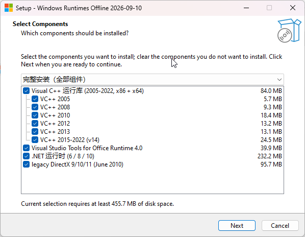

# sub-win-runtime <a href="README_zh-CN.md"></a><a href="README.md"></a>

Offline installer for the common Microsoft runtimes, built from official winget sources.


<p align="center">
  
</p>

## Install

```powershell
git clone https://github.com/Dichgrem/sub-win-runtime.git
cd sub-win-runtime
.\build-bundle.ps1        # fetch official installers → payload/   (core ~124 MB, network needed)
.\build-installer.ps1     # → dist\windows-runtimes-<date>.exe   (126 MB core / 444 MB with extras)
```

Copy the exe to any Windows 10/11 x64 machine and double-click — pick the components you need, no network required.
Append `-IncludeDirectX` / `-IncludeDotNet` to both scripts to bundle legacy DirectX and .NET 6/8/10 (the picker then offers them).

Already online? Use winget directly: `.\install-online.ps1`
CI (manual trigger) builds the full payload and publishes release `v<date>` with `windows-runtimes-<date>.exe` + `.sha256`.

## How It Works

```
winget manifest (URL + SHA-256 + silent switches)
  └─ build-bundle.ps1       → payload/            Microsoft-signed installers
     └─ build-installer.ps1 → windows-runtimes-<date>.exe   Inno Setup + component picker
        └─ double-click     → UAC → pick components → install-offline.ps1 → MSI/Burn silent install
```

## Coverage

| Component                                                     | winget ID              |
| ------------------------------------------------------------- | ---------------------- |
| VC++ 2005 / 2008 / 2010 / 2012 / 2013 / 2015-2022 (x86 + x64) | `Microsoft.VCRedist.*` |
| Visual Studio Tools for Office Runtime 4.0                    | `Microsoft.VSTOR`      |
| Legacy DirectX 9/10/11 _(optional)_                           | `Microsoft.DirectX`    |
| .NET 6 / 8 / 10 _(optional)_                                  | `Microsoft.DotNet.*`   |
